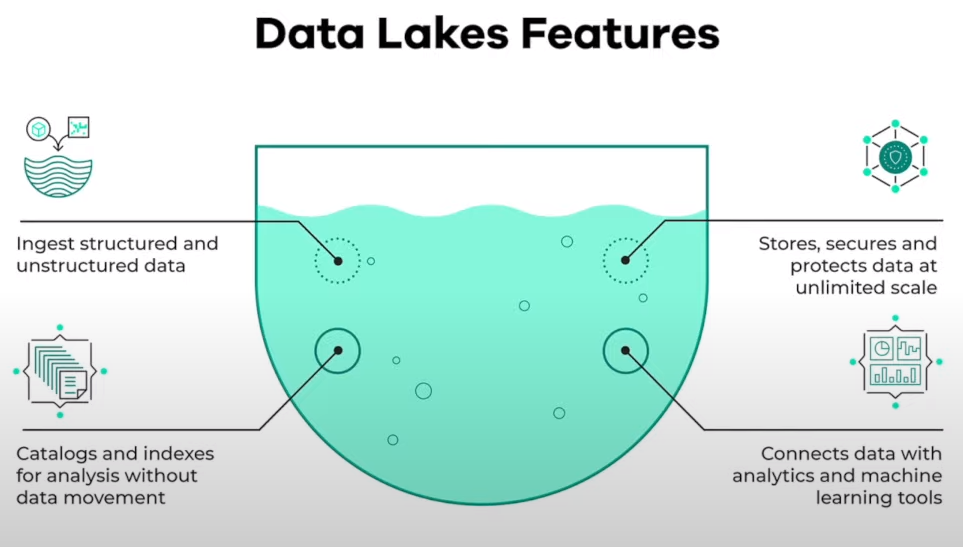
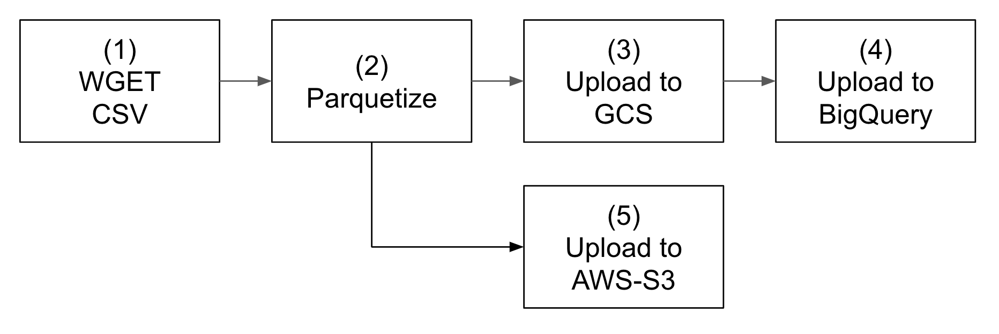
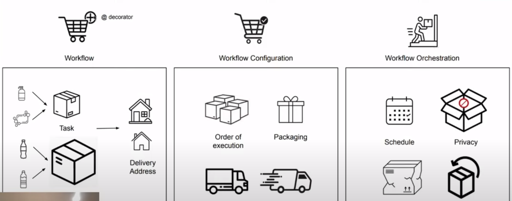
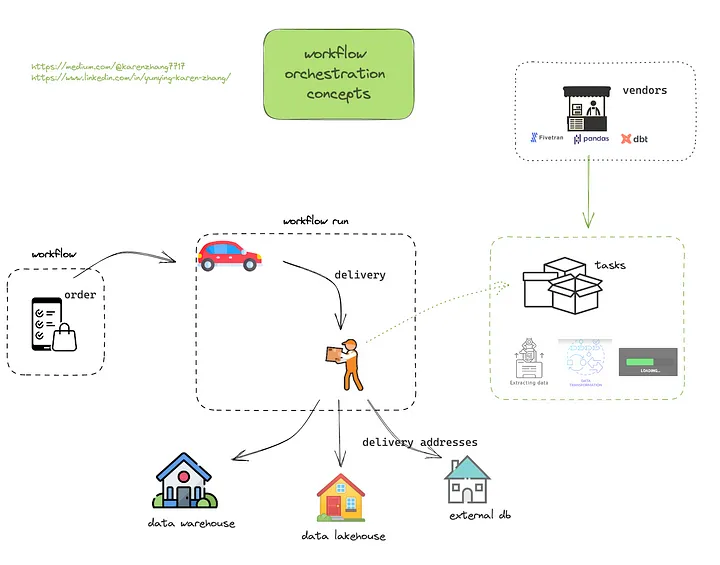
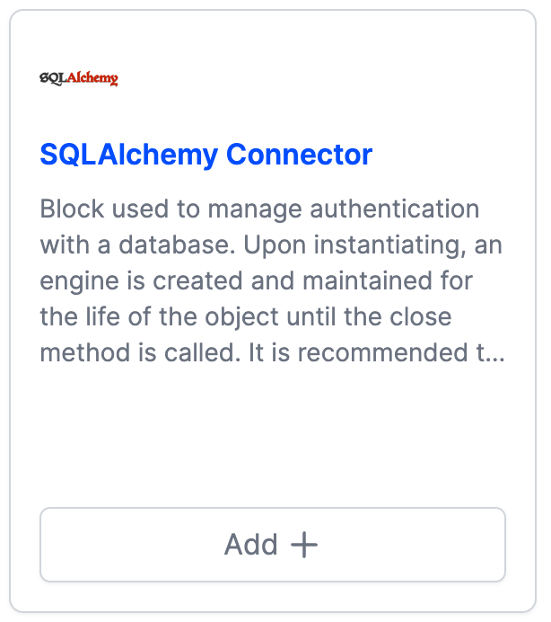
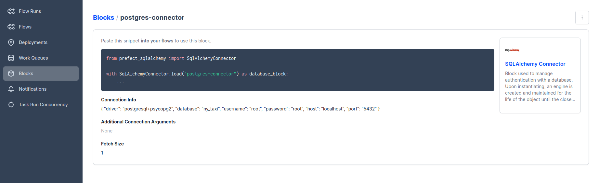

# Week 2: Workflow Orchestration

Pls see [README.md](https://github.com/DataTalksClub/data-engineering-zoomcamp/tree/main/week_2_workflow_orchestration) for week 2 from DataTalksClub GitHub repo.

Below are my notes from week 2.

## Contents

- 2.1 Data Lake
- 2.2 Introduction to Workflow Orchestration
- 2.3 Introduction to Prefect concepts
- 2.4 ETL with GCP & Prefect
- 2.5 From Google Cloud Storage to Big Query
- 2.6 Parametrizing Flow & Deployments
- 2.7 Schedules and Docker Storage with Infrastructure
- 2.8 Prefect Cloud and Additional Resources

## 2.1 Data Lake  

See [DE Zoomcamp 2.1.1 - Data Lake](https://www.youtube.com/watch?v=W3Zm6rjOq70) on Youtube.  

  

- It is a central repository that holds big data from many sources.  
- Generally, the data can be structured, semi-structured or unstructured, so the ideal is to ingest data as quickly as possible and make it available or accessible to other team members like DS, DA, DE.  

### Data Lake vs Data Warehouse

  

### How did Data Lake start?  

- Companies realized the value of data  
- Store and access data quickly  
- Cannot always define structure of data  
- Usefulness of data being realized later in the project lifecycle  
- Increase in data scientists  
- R&D on data products  
- Need for Cheap storage of Big data  

### ETL vs ELT  

- Extract Transform and Load (ETL) vs Extract Load and Transform (ELT)  
- ETL is mainly used for a small amount of data whereas ELT is used for large amounts of data  
- ELT provides data lake support (Schema on read)  

### Gotchas of Data Lake

- Converting into Data Swamp
- No versioning
- Incompatible schemas for same data without versioning
- No metadata associated
- Joins not possible  

### Cloud provider Data Lake

- GCP - cloud storage
- AWS - S3
- AZURE - AZURE BLOB

## 2.2 Introduction to Workflow orchestration

See [DE Zoomcamp 2.2.1 - Introduction to Workflow Orchestration](https://www.youtube.com/watch?v=8oLs6pzHp68) on
Youtube.  

### What is workflow orchestration?

It means governing your data flow in a way that respects orchestration rules and your business logic.  
So, what is the data flow? --> It is what bins and otherwise disparate set of application together. A data flow represents the movement of data from one component or system to another. The data flow may also be described as the transport of data from a source to a destination. An ETL (extract, transform, load) process is a type of data flow.  

**Dataflow concept:**

  

**Workflow Orchestration concept:**





### Core features of Workflow orchestration:

- Remote execution
- Scheduling
- Retries
- Caching
- Integration with external systems (APIs, Databases)
- Ad-hoc run
- Parameterization
- Alerts you when something fails

### Some Workflow Orchestration tools:

- Airflow
- Prefect

## 2.3 Introduction to Prefect concepts

See [DE Zoomcamp 2.2.2 - Introduction to Prefect concepts](https://www.youtube.com/watch?v=jAwRCyGLKOY) on Youtube and [GitHub repository](https://github.com/discdiver/prefect-zoomcamp)

We need a python requirements file.
File `requirements.txt`
```
pandas==1.5.2
pydantic==1.10.0
prefect==2.7.7
prefect-sqlalchemy==0.2.2
prefect-gcp[cloud_storage]==0.2.4
protobuf==4.21.11
pyarrow==10.0.1
pandas-gbq==0.18.1
psycopg2-binary==2.9.5
sqlalchemy==1.4.46
```
#### Ingestion without prefect
**File** `ingest-data.py`
```
import os
import argparse
from time import time
import pandas as pd
from sqlalchemy import create_engine


def ingest_data(user, password, host, port, db, table_name, url):
    
    # the backup files are gzipped, and it's important to keep the correct extension
    # for pandas to be able to open the file
    if url.endswith('.csv.gz'):
        csv_name = 'yellow_tripdata_2021-01.csv.gz'
    else:
        csv_name = 'output.csv'

    os.system(f"wget {url} -O {csv_name}")
    postgres_url = f'postgresql://{user}:{password}@{host}:{port}/{db}'
    engine = create_engine(postgres_url)

    df_iter = pd.read_csv(csv_name, iterator=True, chunksize=100000)

    df = next(df_iter)

    df.tpep_pickup_datetime = pd.to_datetime(df.tpep_pickup_datetime)
    df.tpep_dropoff_datetime = pd.to_datetime(df.tpep_dropoff_datetime)

    df.head(n=0).to_sql(name=table_name, con=engine, if_exists='replace')

    df.to_sql(name=table_name, con=engine, if_exists='append')


    while True: 

        try:
            t_start = time()
            
            df = next(df_iter)

            df.tpep_pickup_datetime = pd.to_datetime(df.tpep_pickup_datetime)
            df.tpep_dropoff_datetime = pd.to_datetime(df.tpep_dropoff_datetime)

            df.to_sql(name=table_name, con=engine, if_exists='append')

            t_end = time()

            print('inserted another chunk, took %.3f second' % (t_end - t_start))

        except StopIteration:
            print("Finished ingesting data into the postgres database")
            break

if __name__ == '__main__':
    user = "postgres"
    password = "admin"
    host = "localhost"
    port = "5433"
    db = "ny_taxi"
    table_name = "yellow_taxi_trips"
    csv_url = "https://github.com/DataTalksClub/nyc-tlc-data/releases/download/yellow/yellow_tripdata_2021-01.csv.gz"

    ingest_data(user, password, host, port, db, table_name, csv_url)
```

First of all, open new terminal in IDEA, run this command to install library:
```
pip install -r requirements.txt
```
When completed, you can check by this command: `prefect version`

I started Docker and executed these commands.
```
mkdir ny_taxi_postgres_data
docker run -d \
  -e POSTGRES_USER="root" \
  -e POSTGRES_PASSWORD="root" \
  -e POSTGRES_DB="ny_taxi" \
  -v $(pwd)/ny_taxi_postgres_data:/var/lib/postgresql/data \
  -p 5432:5432 \
  postgres:13
```
Next, I executed the ingest_data.py   

```python ingest_data.py```   

Open pgcli:

```commandline
pgcli -h localhost -p 5432 -u root -d ny_taxi
```

And run these SQL command:

```
root@localhost:ny_taxi> \dt
+--------+-------------------+-------+-------+
| Schema | Name              | Type  | Owner |
|--------+-------------------+-------+-------|
| public | yellow_taxi_trips | table | root  |
+--------+-------------------+-------+-------+
SELECT 1
Time: 0.006s
root@localhost:ny_taxi> select COUNT(*) from yellow_taxi_trips
+---------+
| count   |
|---------|
| 1369765 |
+---------+
SELECT 1
Time: 0.050s
root@localhost:ny_taxi>
```

#### Ingestion with prefect  
I create a new file python `ingest_data_flow.py` for using prefect
**File** `ingets_data_flow.py`
```
import os
import argparse
from datetime import timedelta
from time import time
import pandas as pd
from sqlalchemy import create_engine
from prefect import flow, task
from prefect.tasks import task_input_hash
from prefect_sqlalchemy import SqlAlchemyConnector


@task(log_prints=True, retries=3, cache_key_fn=task_input_hash, cache_expiration=timedelta(days=1))
def extract_data(url):
    # the backup files are gzipped, and it's important to keep the correct extension
    # for pandas to be able to open the file
    if url.endswith('.csv.gz'):
        csv_name = 'yellow_tripdata_2021-01.csv.gz'
    else:
        csv_name = 'output.csv'

    os.system(f"wget {url} -O {csv_name}")
    df_iter = pd.read_csv(csv_name, iterator=True, chunksize=100000)
    df = next(df_iter)

    df.tpep_pickup_datetime = pd.to_datetime(df.tpep_pickup_datetime)
    df.tpep_dropoff_datetime = pd.to_datetime(df.tpep_dropoff_datetime)
    return df


@task(log_prints=True, retries=3)
def transform_data(df):
    print(f"Pre: missing passenger count: {df['passenger_count'].isin([0]).sum()}")
    df = df[df['passenger_count'] != 0]
    print(f"Post: missing passenger count: {df['passenger_count'].isin([0]).sum()}")
    return df


@task(log_prints=True, retries=3)
def ingest_data(table_name, df):
    connection_block = SqlAlchemyConnector.load("postgres-connector")
    with connection_block.get_connection(begin=False) as engine:
        df.head(n=0).to_sql(name=table_name, con=engine, if_exists='replace')
        df.to_sql(name=table_name, con=engine, if_exists='append')

@flow(name="Subflow", log_prints=True)
def log_subflow(tablename: str):
    print(f"Logging Subflow for: {tablename}")

@flow(name='Ingest Flow')
def main_flow(table_name: str):
    csv_url = "https://github.com/DataTalksClub/nyc-tlc-data/releases/download/yellow/yellow_tripdata_2021-01.csv.gz"
    log_subflow(table_name)
    raw_data = extract_data(csv_url)
    data = transform_data(raw_data)
    ingest_data(table_name, data)


if __name__ == '__main__':
    main_flow("yellow_taxi_trips")
```

Start the Prefect Orion orchestration engine.  
```commandline
prefect orion start
```

Go to http://127.0.0.1:4200/ to open the Orion interface.

You can consult a lot of information about our performances.  

We are interested in **Blocks**.

We go to https://docs.prefect.io/collections/catalog/

See also https://prefecthq.github.io/prefect-sqlalchemy/

But the instructor suggests instead to add the block **SQLAlchemy Connector** from the interface **Blocks** of Orion.  

  

Write or select these parameters :

- **Block Name**: postgres-connector  
- **Driver**: SyncDriver  
- **The driver name to use**: postgresql+psycopg2  
- **The name of the database to use**: ny_taxi  
- **Username**: root  
- **Password**: root  
- **Host**: localhost  
- **Port**: 5432  

Then click on the **Create** button  
  

Then, I executed the python program.  

```
python ingest_data_flow.py
```

Opne `pgcli` and run sql command to view result.

### 2.4 ETL with GCP & Prefect   
See [DE Zoomcamp 2.2.3 - ETL with GCP & Prefect](https://www.youtube.com/watch?v=W-rMz_2GwqQ) on Youtube and the [source code](https://github.com/discdiver/prefect-zoomcamp/tree/main/flows/02_gcp).  

#### Start Prefect Orion  

```
prefect orion start
```

You should be see in the terminal this:
```

 ___ ___ ___ ___ ___ ___ _____    ___  ___ ___ ___  _  _
| _ \ _ \ __| __| __/ __|_   _|  / _ \| _ \_ _/ _ \| \| |
|  _/   / _|| _|| _| (__  | |   | (_) |   /| | (_) | .` |
|_| |_|_\___|_| |___\___| |_|    \___/|_|_\___\___/|_|\_|

Configure Prefect to communicate with the server with:

    prefect config set PREFECT_API_URL=http://127.0.0.1:4200/api

View the API reference documentation at http://127.0.0.1:4200/docs

Check out the dashboard at http://127.0.0.1:4200
```

Then, we can check the dashboard here: http://127.0.0.1:4200  

Create the new folder `02_gcp`, and create a new file with name `etl_web_to_gcs.py`  

### Create a bucket

Go to [Gougle Cloud Console](https://console.cloud.google.com/).

In the **DTC-DE** project, select **Cloud Storage**, and select **Buckets**. I already have a backup called
**dtc_data_lake_dtc-392100**. The instructor uses a bucket named **prefect-de-zoomcamp**.

Inside Orion, select **Blocks** at the left menu, choose the block **GCS Bucket** and click **Add +** button. Complete
the form with:

- Block Name: zoom-gcs

- Name of the bucket: dtc_data_lake_dtc-392100  

  

### Modify our python program

We then obtain a fragment of code to insert into our python code. Which allows us to add the `write_gcs` method to
`etl_web_to_gcs.py`.  

**File `etl_web_to_gcs.py`**

```
from pathlib import Path
import pandas as pd
from prefect import flow, task
from prefect_gcp.cloud_storage import GcsBucket

@task(log_prints=True, retries=3)
def fetch(dataset_url: str) -> pd.DataFrame:
    """Read data from web into pandas DataFrame"""

    df = pd.read_csv(dataset_url)
    return df

@task(log_prints=True, retries=3)
def clean(df=pd.DataFrame) -> pd.DataFrame:
    """Fix dtype issues"""
    df['tpep_pickup_datetime'] = pd.to_datetime(df['tpep_pickup_datetime'])
    df['tpep_dropoff_datetime'] = pd.to_datetime(df['tpep_dropoff_datetime'])
    print(df.head(2))
    print(f"columns: {df.dtypes}")
    print(f"rows: {len(df)}")
    return df

@task(log_prints=True, retries=3)
def write_local(df: pd.DataFrame, color: str, dataset_file: str) -> Path:
    """Wirte DataFrame out locally as parquet file"""
    path = Path(f"data/{color}/{dataset_file}.parquet")
    df.to_parquet(path, compression='gzip')
    return path

@task(log_prints=True, retries=3)
def write_gcs(path: Path) -> None:
    """Upload local parquet file to GCS"""
    gcs_block = GcsBucket.load("zoom-gcs")
    gcs_block.upload_from_path(from_path=path, to_path=path)
    return


@flow()
def etl_web_to_gcs() -> None:
    """The main ETL function"""
    color = "yellow"
    year = 2021
    month = 1
    dataset_file = f"{color}_tripdata_{year}-{month:02}"
    dataset_url = f"https://github.com/DataTalksClub/nyc-tlc-data/releases/download/{color}/{dataset_file}.csv.gz"

    df = fetch(dataset_url)
    df_clean = clean(df)
    path = write_local(df_clean, color, dataset_file)
    write_gcs(path)

if __name__ == '__main__':
    etl_web_to_gcs()
```

### Run the python program again

Let’s run the python program again.

``` bash
python flows/02_gcp/etl_web_to_gcs.py
```

```txt
(venv) (base) sang@sang-desktop:~/Desktop/Learning/DE/DTC/week_2$ python flows/02_gcp/etl_web_to_gcs.py 
09:14:52.147 | INFO    | prefect.engine - Created flow run 'robust-seal' for flow 'etl-web-to-gcs'
09:14:52.298 | INFO    | Flow run 'robust-seal' - Created task run 'fetch-b4598a4a-0' for task 'fetch'
09:14:52.299 | INFO    | Flow run 'robust-seal' - Executing 'fetch-b4598a4a-0' immediately...
/home/sang/Desktop/Learning/DE/DTC/week_2/flows/02_gcp/etl_web_to_gcs.py:10: DtypeWarning: Columns (6) have mixed types. Specify dtype option on import or set low_memory=False.
  df = pd.read_csv(dataset_url)
09:14:56.079 | INFO    | Task run 'fetch-b4598a4a-0' - Finished in state Completed()
09:14:56.106 | INFO    | Flow run 'robust-seal' - Created task run 'clean-b9fd7e03-0' for task 'clean'
09:14:56.107 | INFO    | Flow run 'robust-seal' - Executing 'clean-b9fd7e03-0' immediately...
09:14:56.532 | INFO    | Task run 'clean-b9fd7e03-0' -    VendorID tpep_pickup_datetime  ... total_amount  congestion_surcharge
0       1.0  2021-01-01 00:30:10  ...         11.8                   2.5
1       1.0  2021-01-01 00:51:20  ...          4.3                   0.0

[2 rows x 18 columns]
09:14:56.533 | INFO    | Task run 'clean-b9fd7e03-0' - columns: VendorID                        float64
tpep_pickup_datetime     datetime64[ns]
tpep_dropoff_datetime    datetime64[ns]
passenger_count                 float64
trip_distance                   float64
RatecodeID                      float64
store_and_fwd_flag               object
PULocationID                      int64
DOLocationID                      int64
payment_type                    float64
fare_amount                     float64
extra                           float64
mta_tax                         float64
tip_amount                      float64
tolls_amount                    float64
improvement_surcharge           float64
total_amount                    float64
congestion_surcharge            float64
dtype: object
09:14:56.535 | INFO    | Task run 'clean-b9fd7e03-0' - rows: 1369765
09:14:56.570 | INFO    | Task run 'clean-b9fd7e03-0' - Finished in state Completed()
09:14:56.595 | INFO    | Flow run 'robust-seal' - Created task run 'write_local-f322d1be-0' for task 'write_local'
09:14:56.596 | INFO    | Flow run 'robust-seal' - Executing 'write_local-f322d1be-0' immediately...
09:14:59.564 | INFO    | Task run 'write_local-f322d1be-0' - Finished in state Completed()
09:14:59.585 | INFO    | Flow run 'robust-seal' - Created task run 'write_gcs-1145c921-0' for task 'write_gcs'
09:14:59.586 | INFO    | Flow run 'robust-seal' - Executing 'write_gcs-1145c921-0' immediately...
/home/sang/Desktop/Learning/DE/DTC/week_2/venv/lib/python3.11/site-packages/google/auth/_default.py:78: UserWarning: Your application has authenticated using end user credentials from Google Cloud SDK without a quota project. You might receive a "quota exceeded" or "API not enabled" error. See the following page for troubleshooting: https://cloud.google.com/docs/authentication/adc-troubleshooting/user-creds. 
  warnings.warn(_CLOUD_SDK_CREDENTIALS_WARNING)
09:15:00.134 | WARNING | google.auth._default - No project ID could be determined. Consider running `gcloud config set project` or setting the GOOGLE_CLOUD_PROJECT environment variable
09:15:00.134 | INFO    | Task run 'write_gcs-1145c921-0' - Getting bucket 'dtc_data_lake_dtc-392100'.
/home/sang/Desktop/Learning/DE/DTC/week_2/venv/lib/python3.11/site-packages/google/auth/_default.py:78: UserWarning: Your application has authenticated using end user credentials from Google Cloud SDK without a quota project. You might receive a "quota exceeded" or "API not enabled" error. See the following page for troubleshooting: https://cloud.google.com/docs/authentication/adc-troubleshooting/user-creds. 
  warnings.warn(_CLOUD_SDK_CREDENTIALS_WARNING)
09:15:00.632 | WARNING | google.auth._default - No project ID could be determined. Consider running `gcloud config set project` or setting the GOOGLE_CLOUD_PROJECT environment variable
09:15:02.851 | INFO    | Task run 'write_gcs-1145c921-0' - Uploading from PosixPath('data/yellow/yellow_tripdata_2021-01.parquet') to the bucket 'dtc_data_lake_dtc-392100' path 'data/yellow/yellow_tripdata_2021-01.parquet'.
09:15:09.518 | INFO    | Task run 'write_gcs-1145c921-0' - Finished in state Completed()
09:15:09.551 | INFO    | Flow run 'robust-seal' - Finished in state Completed('All states completed.')
```

### Bucket is created!

By checking on Google Cloud, we should see our bucket of 20.7 Mb. Congratulation!  

