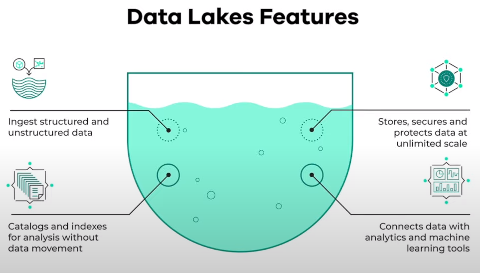
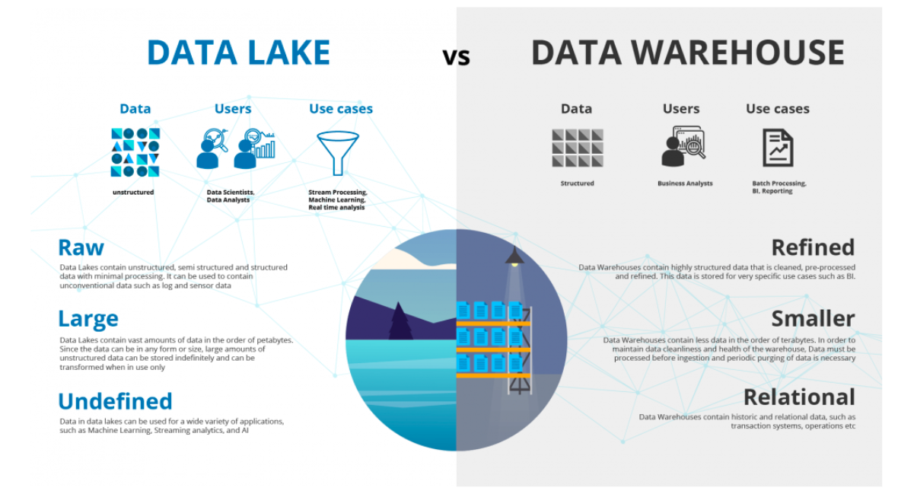
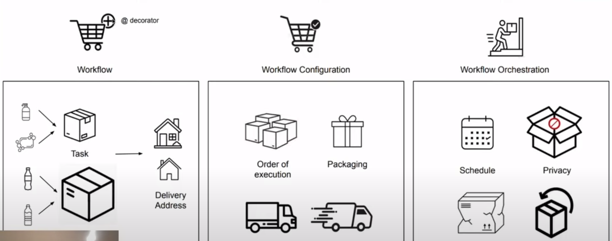
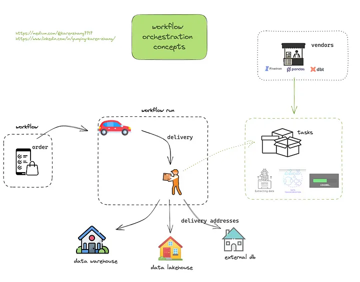

# Week 2: Workflow Orchestration

Pls see [README.md](https://github.com/DataTalksClub/data-engineering-zoomcamp/tree/main/week_2_workflow_orchestration) for week 2 from DataTalksClub GitHub repo.

Below are my notes from week 2.

## Contents

- 2.1 Data Lake
- 2.2 Introduction to Workflow Orchestration
- 2.3 Introduction to Prefect concepts
- 2.4 ETL with GCP & Prefect
- 2.5 From Google Cloud Storage to Big Query
- 2.6 Parametrizing Flow & Deployments
- 2.7 Schedules and Docker Storage with Infrastructure
- 2.8 Prefect Cloud and Additional Resources

## 2.1 Data Lake  

See [DE Zoomcamp 2.1.1 - Data Lake](https://www.youtube.com/watch?v=W3Zm6rjOq70) on Youtube.  

  

- It is a central repository that holds big data from many sources.  
- Generally, the data can be structured, semi-structured or unstructured, so the ideal is to ingest data as quickly as possible and make it available or accessible to other team members like DS, DA, DE.  

### Data Lake vs Data Warehouse

  

### How did Data Lake start?  

- Companies realized the value of data  
- Store and access data quickly  
- Cannot always define structure of data  
- Usefulness of data being realized later in the project lifecycle  
- Increase in data scientists  
- R&D on data products  
- Need for Cheap storage of Big data  

### ETL vs ELT  

- Extract Transform and Load (ETL) vs Extract Load and Transform (ELT)  
- ETL is mainly used for a small amount of data whereas ELT is used for large amounts of data  
- ELT provides data lake support (Schema on read)  

### Gotchas of Data Lake

- Converting into Data Swamp
- No versioning
- Incompatible schemas for same data without versioning
- No metadata associated
- Joins not possible  

### Cloud provider Data Lake

- GCP - cloud storage
- AWS - S3
- AZURE - AZURE BLOB

## 2.2 Introduction to Workflow orchestration

See [DE Zoomcamp 2.2.1 - Introduction to Workflow Orchestration](https://www.youtube.com/watch?v=8oLs6pzHp68) on
Youtube.  

### What is workflow orchestration?

It means governing your data flow in a way that respects orchestration rules and your business logic.  
So, what is the data flow? --> It is what bins and otherwise disparate set of application together. A data flow represents the movement of data from one component or system to another. The data flow may also be described as the transport of data from a source to a destination. An ETL (extract, transform, load) process is a type of data flow.  

**Dataflow concept:**

  

**Workflow Orchestration concept:**

### Core features of Workflow orchestration:

- Remote execution
- Scheduling
- Retries
- Caching
- Integration with external systems (APIs, Databases)
- Ad-hoc run
- Parameterization
- Alerts you when something fails

### Some Workflow Orchestration tools:

- Airflow
- Prefect

